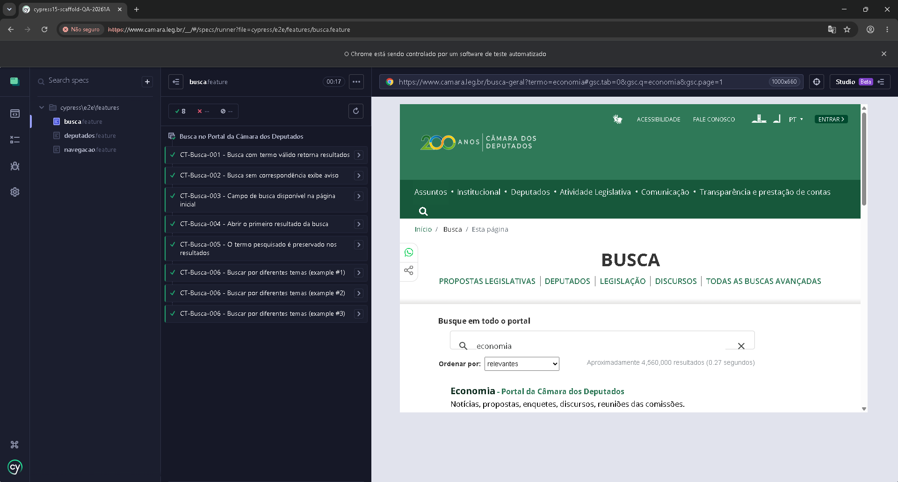
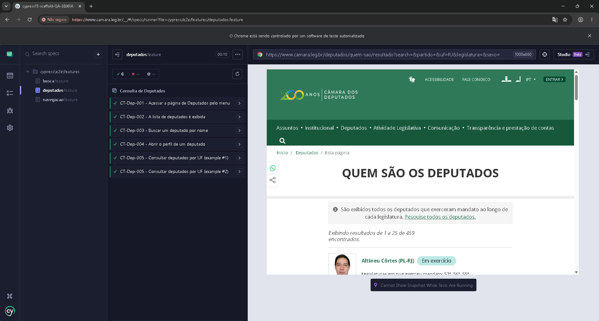
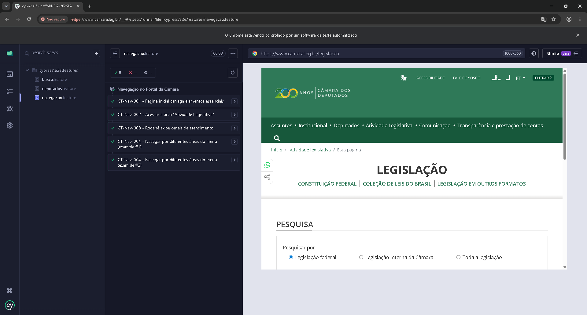
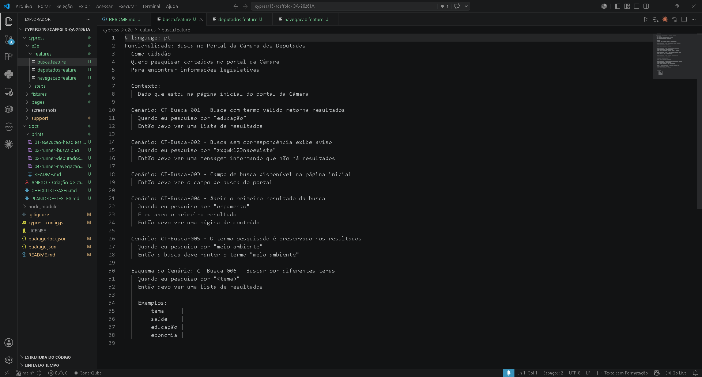
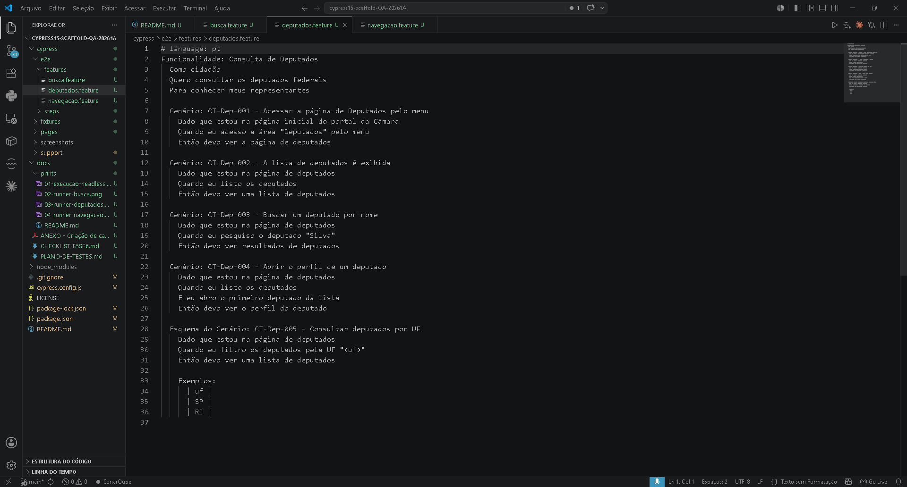
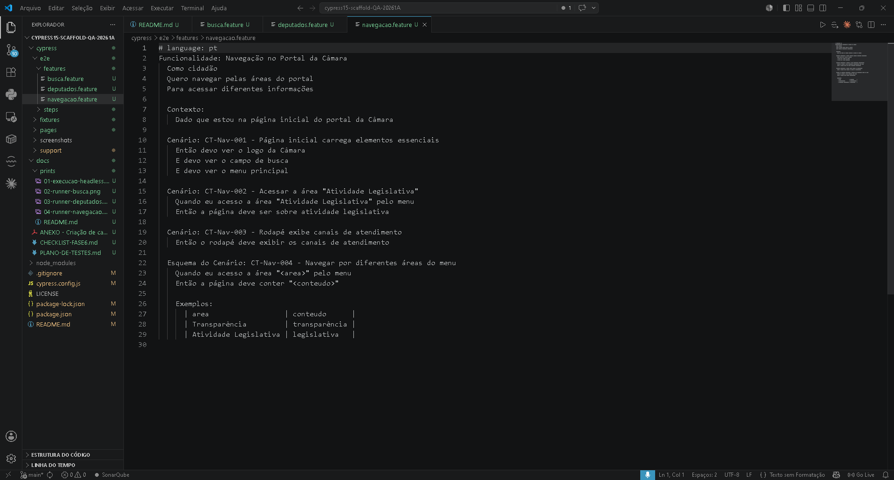
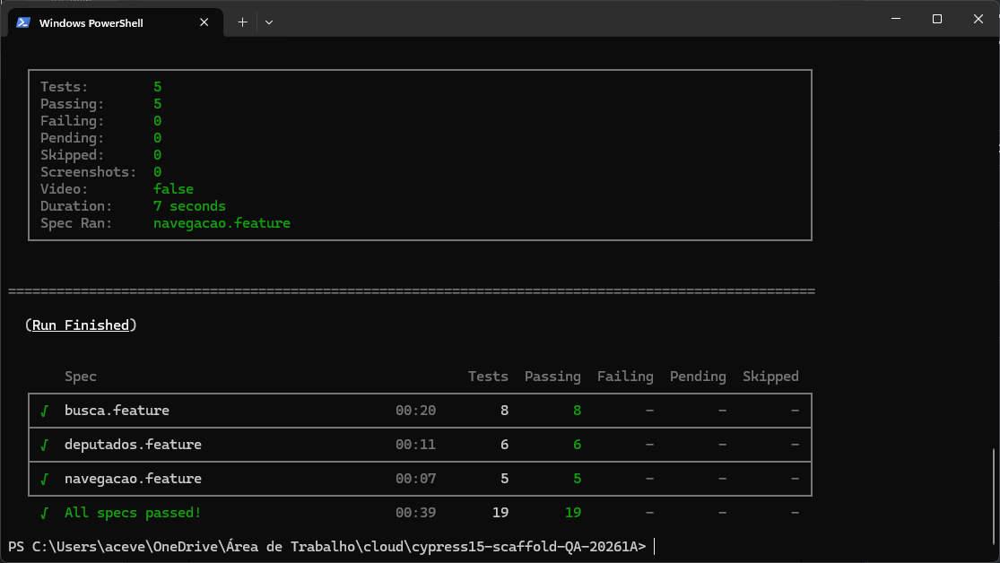

# QA-20261A — Projeto VA02 (BDD: Cypress + Cucumber + Gherkin)

Projeto da disciplina de **Quality Assurance (P5)**. Automação de testes E2E com abordagem
**BDD** sobre um site público governamental: o **Portal da Câmara dos Deputados**
(`https://www.camara.leg.br`).

- **Turma:** P5A
- **Equipe:** Feliphe Blatt
- **Alvo:** Câmara dos Deputados (consulta de dados parlamentares)
- **Stack:** Node.js · Cypress 15 · `@badeball/cypress-cucumber-preprocessor` · esbuild

> 🎥 **Vídeo de apresentação:** _(adicionar o link do YouTube aqui após a gravação)_

---

## 1. Planejamento dos testes

Testamos três funcionalidades públicas do portal (sem login/captcha): **busca**,
**consulta de deputados** e **navegação**. Para cada uma, mapeamos o **fluxo principal** e os
**fluxos alternativos/exceção**, conforme a metodologia de casos de teste do anexo da
disciplina.

- **Em escopo:** busca por termo, busca sem resultado, consulta/filtro de deputados, navegação por menus e rodapé.
- **Fora de escopo:** login/autenticação, áreas com captcha, downloads.
- **Dados de teste:** [`cypress/fixtures/dados.json`](cypress/fixtures/dados.json).
- **Critério de aceite:** os 15 testes verdes em `npm run cy:run`.

📄 Planejamento completo + casos de teste detalhados (formato do anexo):
[`docs/PLANO-DE-TESTES.md`](docs/PLANO-DE-TESTES.md).

## 2. Cenários de teste (15)

**12 Cenários + 3 Esquemas do Cenário** (mínimo do projeto: 3 cenários + 1 esquema por pessoa).

### Busca no portal — [`busca.feature`](cypress/e2e/features/busca.feature)
- **CT-Busca-001** — Busca com termo válido retorna resultados
- **CT-Busca-002** — Busca sem correspondência exibe aviso
- **CT-Busca-003** — Campo de busca disponível na página inicial
- **CT-Busca-004** — Abrir o primeiro resultado da busca
- **CT-Busca-005** — O termo pesquisado é preservado nos resultados
- **CT-Busca-006** — *(Esquema do Cenário)* Buscar por diferentes temas (`saúde`, `educação`, `economia`)



### Consulta de deputados — [`deputados.feature`](cypress/e2e/features/deputados.feature)
- **CT-Dep-001** — Acessar a página de Deputados pelo menu
- **CT-Dep-002** — A lista de deputados é exibida
- **CT-Dep-003** — Buscar um deputado por nome
- **CT-Dep-004** — Abrir o perfil de um deputado
- **CT-Dep-005** — *(Esquema do Cenário)* Consultar deputados por UF (`SP`, `RJ`)



### Navegação — [`navegacao.feature`](cypress/e2e/features/navegacao.feature)
- **CT-Nav-001** — Página inicial carrega elementos essenciais
- **CT-Nav-002** — Acessar a área "Atividade Legislativa"
- **CT-Nav-003** — Rodapé exibe canais de atendimento
- **CT-Nav-004** — *(Esquema do Cenário)* Navegar por diferentes áreas do menu (`Transparência`, `Atividade Legislativa`)



## 3. Automação dos cenários

- **Features** (Gherkin em português) em `cypress/e2e/features/`.
- **Steps** em `cypress/e2e/steps/` (steps compartilhados em `comum.steps.js`).
- **PageObjects** em `cypress/pages/` (`busca`, `deputados`, `portal`).
- **Comando customizado** `cy.buscarNoPortal(termo)` em `cypress/support/commands.js`.
- Configuração BDD em `cypress.config.js` (`@badeball` + esbuild) e em `package.json`
  (chave `cypress-cucumber-preprocessor`, apontando os steps para `cypress/e2e/steps/`).

As features escritas em **Gherkin (português)**:







## 4. Como executar

Pré-requisitos: **Node.js 18+** e **npm**.

```bash
# 1. Instalar dependências
npm install

# 2. Abrir o Cypress (modo interativo)
npm run cy:open
#   → escolher "E2E Testing" → um navegador → rodar as features

# (alternativa) rodar tudo headless
npm run cy:run
```



*Resultado de `npm run cy:run`: **All specs passed! 19/19** (busca 8 · deputados 6 · navegação 5).*

## 5. Estrutura do projeto

```
cypress/
  e2e/
    features/   busca.feature · deputados.feature · navegacao.feature
    steps/      comum.steps.js · busca.steps.js · deputados.steps.js · navegacao.steps.js
  pages/        busca.page.js · deputados.page.js · portal.page.js
  fixtures/     dados.json
  support/      commands.js · e2e.js
docs/           PLANO-DE-TESTES.md · CHECKLIST-FASE6.md
cypress.config.js · package.json
```

> ℹ️ Os seletores dos PageObjects foram **validados contra o site real** (suíte 15/15 verde).
> Como o portal é público e pode mudar com o tempo, eventuais ajustes pontuais podem ser
> feitos com o *Selector Playground* do Cypress.
